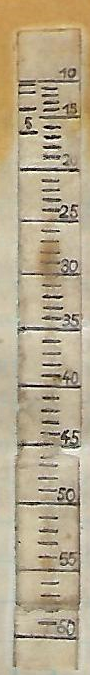
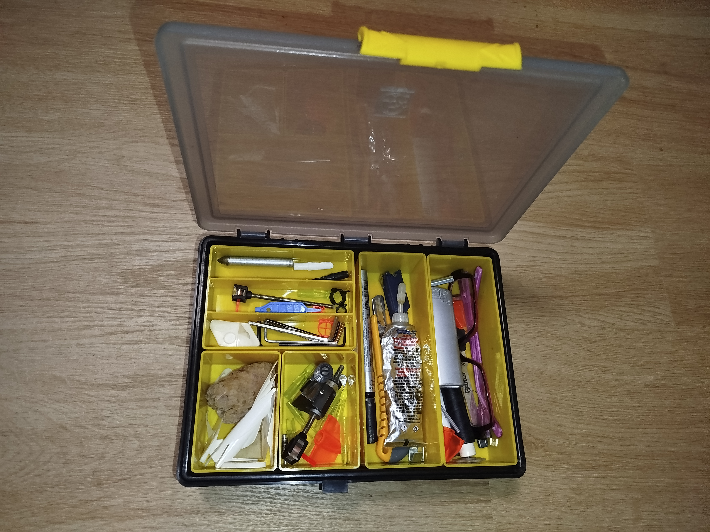

# Sofa
There are no excuses in a match: "I set the meter wrong", "I lost my tab" or something like that. It's best to arrange all this in the peace of your home beforehand. I always did it in the living room at the coffee table, in peace and warmth, to the sounds of pleasant music, sitting on the couch. When you win by a round or two, it's possible precisely because of good preparation at home. I've always defended the thesis that a match can be won "on the couch".

# Scale on the measuring device
Preparing the scale on the measuring device is a process that takes several days, even a week.
My procedure is as follows:

+ First, I stick a new white strip on the measuring device. I always use self-adhesive labels, the ones for school books. I cut the strip accordingly, so that I use the maximum space that the measuring device allows, so that I have as much space as possible for drawing.
+ The next step is the so-called shooting. I stand at 10m, shoot and move the measuring device to get accurate hits in height. Then I lightly draw a line and move five or ten meters back. When shooting, a prerequisite is that we have the bow as tuned as possible. It is also necessary to shoot in suitable weather conditions (wind, light). And of course on flat terrain. If we don't have a "shooting day", we don't shoot!
I repeat the process until I have drawn all the desired distances of five meters. I usually repeat the whole shooting process over several days.
+ Before I start the final drawing of the rock, I check that there are no anomalies on the rock. This means that the distance between the lines slowly increases with distance. If not, there is something wrong with the shooting or the tuning of the bow.
+ When I am satisfied with the shooting, I go back to the couch. I take a pencil and draw the rock so that it will be clear and unambiguous during the shooting what distance I want to set. I prepared a kind of template for drawing the rock. When I am satisfied with the drawing, I polish everything with clear nail polish to protect it from rain, dirt and wear.

*my scale made for the 1986 World Cup*

# Spare equipment
Always have a spare tab, sling, string...

It is recommended that you bring a box of small items and tools with you.

