# Ocenjevanje razdalj
Polovica tarč na Arrowheadu je neznanih, torej je potrebno razdaljo oceniti. Najprej moramo ugotoviti velikost tarče/lica. To pri licih premera 20cm in 40cm ni problem, saj je v prvem primeru na tarči 12 v drugem primeru pa so 4 lica. Problem je pa ugotoviti ali je lice premera 60cm ali 80cm. Tukaj si lahko pomagamo z velikostjo podlog, vendar pozor podloge niso vedno enako velike! Včasih se postavljalci prog poslužujejo "trika", da za lice premera 60cm (manjše lice) uporabijo manjšo podlogo in obratno ter nas s tem zavedejo.
Ko ugotovimo velikost lica s tem vemo v katerem območju je količek. Naprimer rdeč količek za lice premera 60cm je med 20m in 35m. Bolj izkušeni tekmovalci si pri tem pomagajo tudi s pozicijo količkov ostalih barv. V našem primeru (lice premera 60cm) je moder količek lahko med 15m in 30m. Če sta slučajno količka na istem mestu se nam območje avtomatsko skrči na 20m do 30m. Potem natančneje ocenimo razdaljo, pri tem se poslužimo različnih metod. 
# Ocenjevanje "na oko"
Pri tej metodi po občutku ocenimo razdaljo. Ta metoda je najenostavnejša, najhitrejša pa tudi najmanj natančna, odvisno od sposobnosti in izkušenj ocenjevalca.
# Deljenje razdalje "na pol"
Pri tej metodi celotno razdaljo razdelimo približno na pol in potem ocenimo bližnji del.
# Polaganje "metrov"
Ta metoda je uporabna pri majhnih razdaljah, ideja pa je, da poskušamo razdaljo oceniti tako da "polagamo" meter za metrom.
# Ocenjevanje "na palec"
Ocenjevanje "na palec" je v bistvu precej stara metoda in je predhodnica viziranja. Pri tej metodi iztegnemo roko in gledamo koliko dvignjen palec pokrije nek predmet (slika). Bolj ga pokrije daljša je razdalja in obratno.  
# Viziranje - prepovedan sadež
Viziranje je ena bolj natančnih metod ocenjevanja razdalje do tarče. Ideja viziranja temelji na Talesov-em izreku o sorazmerjih.

*Talesov izrek*

Kako si s tem lahko pomagamo?
Vzemimo da je a razdalja med očesom in merkom, b je premer merka, C razdalja do tarče in D premer tarče, oziroma sorazmerni delež pokritosti tarče z merkom.
Privzamemo da so a, b in D konstante, potem lahko iz teh podatkov izračunamo C.

*Viziranje*

