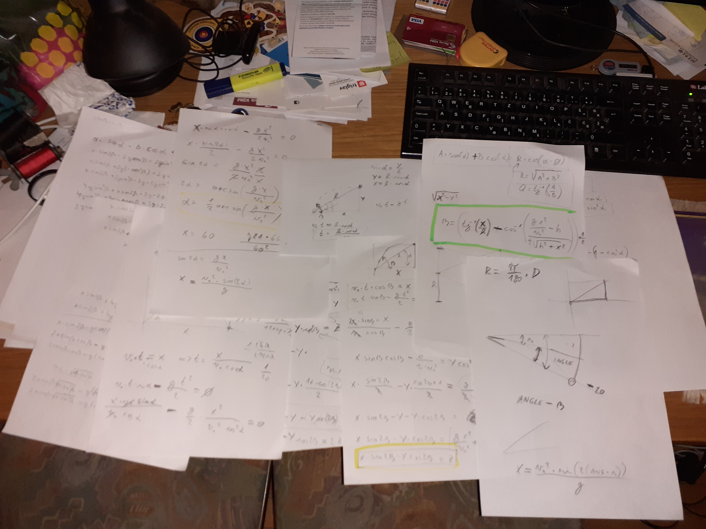
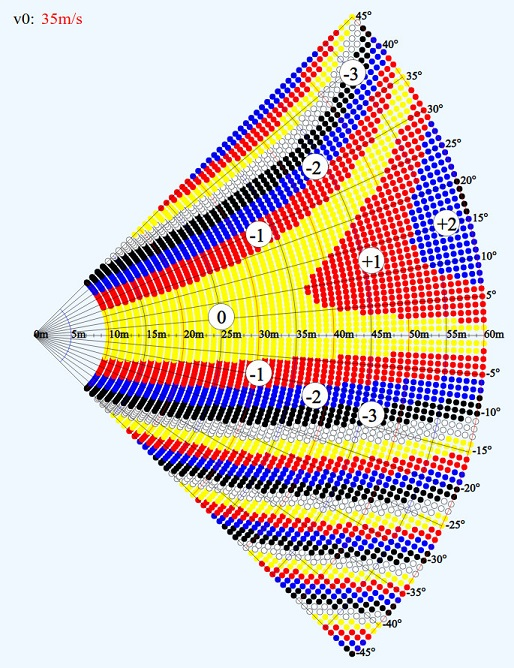

# Zgodba o poševnem metu

Ko sem začel streljati Arrowhead, takrat imenovan še Hunter & Field, sem se vedno spraševal, koliko odbiti ali dodati na merilni napravi, če tarča ni v horizontali. Med lokostrelci so se kresala mnenja, izmenjevale izkušnje... Potem pa v osemdesetih letih dobim fotokopijo nekega grafa.

*Švedski graf*

Naredili so ga Švedi. Na strelišče so pripeljali ogromen žerjav, potem pa streljali na različne razdalje pod različnimi koti. Poskušali znova in znova. Narisali so ga popolnoma empirično - s poskušanjem, brez fizikalne osnove. Ta graf sem uporabljal in moram priznati, je kar držal. Ampak po glavi se mi je motalo kar naprej, kako bi to točno izračunal. Ker mi matematika in fizika nista tuji, sem se lotil zadeve. Cilj mi je bil, kako nastaviti merilno napravo pri določeni razdalji in kotu, kot bi streljal na ravnem.

V roke vzamem svinčnik in papir in po nekaj dneh mi uspe razvozljati uganko, dobim formulo. Zanemaril sem zračni upor, ki bi se tako ali tako kompenziral, saj se dolžina parabole malenkost spremeni pod različnimi koti. Zanimivo je to, da edino kar vpliva na izračun, je začetna hitrost in pa seveda gravitacijski pospešek. Slednji je pri nas tako ali tako približno 9.81 m/s2. Izpeljava je bila kar trd oreh, ker se je v formuli pojavila kar kompleksna trigonometrična funkcija, pa ne bi sedaj o tem.

*izpeljana formula na papirju*

Nato pa za računalnik, sprogramirati in narisati graf. V spustnem meniju so predstavljeni grafi v odvisnosti od začetne hitrosti (v0).
Kratka razlaga: različno obarvane pikice so kjer je treba dodati ali odvzeti meter, dva, tri ...

*izračunan graf pri začetni hitrosti puščice 35m/s*

Seveda je potrebno pri tem upoštevati, da se ustreli tako kot na ravnem. Se pravi zgornji del, ramenski obroč, roke v liniji, spust... Bistvo je da se prepogneš v bokih. Je težko, samo z nekaj treninga se da.

Ena misel: Ko so vprašali najboljšega plezalca vseh časov Wolfganga Güllicha, katera mišica je najpomembnejša pri plezanju. Je odgovoril: glava. To velja tudi v lokostrelstvu. 

