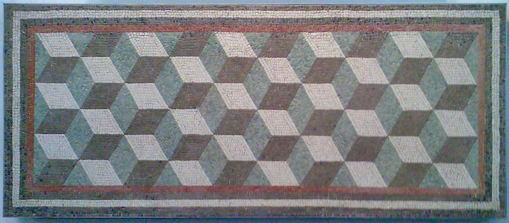
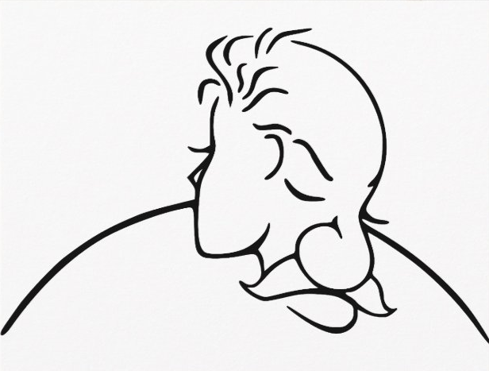

# Optične prevare

Gledaš z očmi, vidiš z možgani.

Vidiš, kar hočeš videti.

Ko se videno razlikuje od realnosti, govorimo o <strong>optični iluziji<strong>.

Iluzije so zelo raznolike, njihova razvrstitev pa je težavna,
ker osnovni vzrok pogosto ni jasen.

Klasifikacija, ki jo je predlagal <strong>Richard Gregory<strong>, je uporabna
kot orientacija. Po njej ločimo:

- <strong>fizične iluzije<strong>
- <strong>fiziološke iluzije<strong>
- <strong>kognitivne iluzije<strong>

Vsaka skupina vključuje:
<strong>dvoumnosti, izkrivljanja, paradokse in fikcije<strong>.

---

  <figure>
    
    <figcaption>Rimski geometrijski mozaik</figcaption>
  </figure>

  <figure>
    
    <figcaption>Dekle ali starec?</figcaption>
  </figure>

  <figure>
    
    <figcaption>Dekle ali ptica?</figcaption>
  </figure>

  <figure>
    
    <figcaption>Morski pes ali ptica?</figcaption>
  </figure>

---

<strong>Zakaj pride do optičnih iluzij?</strong>

Možgani ne zaznavajo sveta neposredno.
Vidne dražljaje <strong>interpretirajo</strong> na podlagi izkušenj,
pričakovanj in konteksta.

Iluzija nastane takrat, ko ta razlaga <strong>ne ustreza fizikalni realnosti</strong>.

